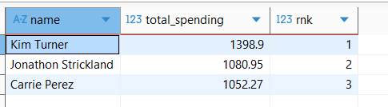
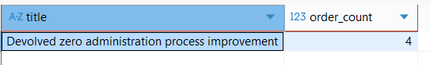
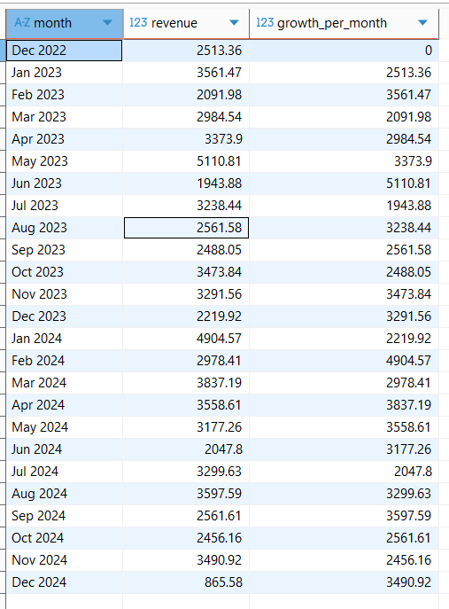

# Bookstore-Sales-Analysis-using-SQL

📊 Bookstore Sales Analysis using SQL

📌 Business Overview

This project is based on a local bookstore that manages its daily operations including book inventory, customer purchases, and order transactions. The store offers a wide range of books across different genres and serves customers from multiple locations.

The goal of this project is to analyze transactional data using SQL to uncover meaningful insights that support data-driven decision-making in sales, customer behavior, and inventory management.

🎯 Problem Statement

The bookstore generates a large volume of transactional data but lacks structured analysis to derive actionable insights.

This project aims to answer key business questions:

-- Which books and genres are performing best?

-- Who are the highest-value customers?

-- How is revenue trending over time?

Is the inventory sufficient to meet demand?

🛠 Tools & Technologies
PostgreSQL

📂 Dataset Description

The dataset consists of three main tables:

**Books** → Book details (title, genre, price, stock)

**Customers** → Customer information (name, country, etc.)

**Orders** → Transaction data (order date, quantity, total amount)

📈 Key Insights

Top customers such as **Kim Turner**, **Jonathon Strickland**, and **Carrie Perez** contributed the highest share of total revenue
A small group of customers drives a significant portion of sales

Monthly revenue analysis shows fluctuations in sales, indicating varying demand patterns
Certain months recorded higher revenue, suggesting potential seasonal trends

The most frequently ordered book was **Devolved zero administration process improvement**, indicating high demand
Genres **Mystery** and **Science Fiction** contributed significantly to total sales

Some books have low remaining stock, highlighting the need for timely restocking
Inventory tracking helps prevent stockouts and lost sales

📊 Growth Insights
Month-over-month growth analysis revealed changes in revenue performance
Helps identify periods of business growth and decline

## 📊 Sample Outputs

### 🔹 Top Customers

### 🔹 Most Frequently Ordered Book

### 🔹 Monthly Rebenue Growth

💡 **Recommendations**

Focus on promoting top-performing books and genres
Retain high-value customers through targeted offers or loyalty programs
Monitor low-stock items to avoid inventory shortages
Use sales trends to plan seasonal promotions and stock management
